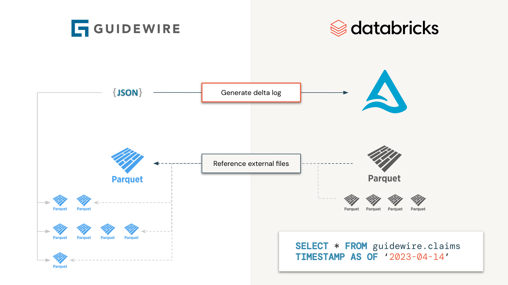
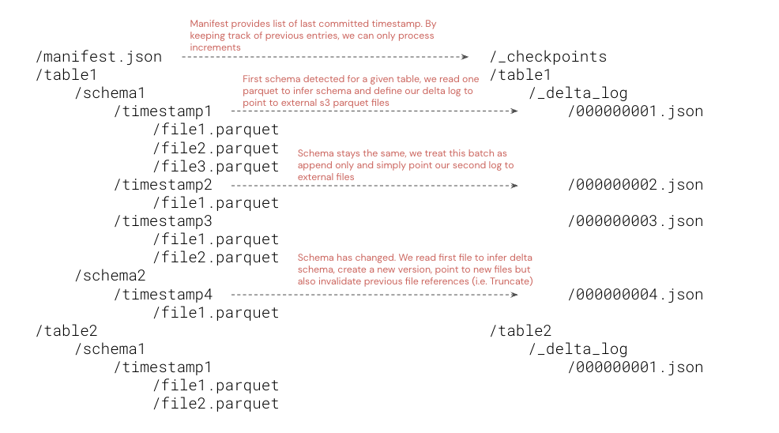

[](https://docs.databricks.com/release-notes/runtime/12.2.html)
[](https://databricks.com/try-databricks)
[](https://databricks.com/try-databricks)

**Interpreting guidewire CDA as delta table:** 
*As a technology company, [Guidewire](https://www.guidewire.com/) offers an industry platform for property and casualty 
insurance carriers worldwide. Through different products and services under their insurance suite, they provide users
with the operation capabilities required to acquire, process and settle claims, maintains policies, support underwriting
and adjustment processes. Databricks on the other hand provides users with analytical capabilities (from basic 
reporting to complex ML solutions) through their
[lakehouse for Insurance](https://www.databricks.com/solutions/industries/financial-services). By combining both
platforms together, P&C insurance companies have now the ability to start integrating advanced analytics capabilities
(AI/ML) into their core business processes, enriching customer information with alternative data (e.g. weather data) 
but equally reconciling and reporting critical information at enterprise scale.*

___

## Approach

Guidewire supports data access to analytical environment via their Cloud Data Access offering 
([CDA](https://developer.guidewire.com/introducing-guidewire-data-platform/)). Storing files as individual parquet files
under different timestamps and schema evolution is unfortunately making processing difficult for end users. Instead
of processing files individually, why wouldn't we generate the `delta log` manifest files to only read information
we need, when we need it, without having to download, process and reconcile complex information? This is the principle
behind this initiative. The generated delta table will not be materialized (data will not be physically moving) but act
as a [shallow clone](https://docs.databricks.com/sql/language-manual/delta-clone.html) to guidewire data. 



More specifically, we will process all Guidewire tables independently, in parallel (i.e. as a spark job), where each
task will consist in only listing parquet files and folders and generating delta log accordingly. From an end user 
standpoint, guidewire will look as a Delta table and be processed as such, reducing processing time from days to seconds 
(since we do not have to download and process each file through many spark jobs).



As the data is now on Delta lake (physically materialized or not), one can benefit from all the downstream 
capabilities of delta lake, "subscribing" to changes via 
[auto-loader](https://docs.databricks.com/ingestion/auto-loader/index.html) capabilities, delta live table
([DLT](https://www.databricks.com/product/delta-live-tables)) or even 
[delta sharing](https://www.databricks.com/product/delta-sharing), accelerating time to insights from days to minutes.

## A word of caution

As this model follows a shallow clone approach, it is recommended to only grant read permission to end user since a 
`VACCUM` operation on the generated delta would possibly result in data loss on the guidewire S3 bucket. We highly
recommend organization not exposing this raw dataset to end users but rather create a SILVER version with materialized
data for consumption. Note that an `OPTIMIZE` command will result in materialization of latest delta snapshot with optimized
parquet files. Only the relevant files will be physically downloaded from original S3 to destination table.

## Usage

```scala
import com.databricks.labs.guidewire.Guidewire
val manifestUri = "s3://bucket/key/manifest.json"
val databasePath = "/path/to/delta/database"
Guidewire.index(manifestUri, databasePath)
```

This command will run on a data increment by default, loading our previous checkpoints stored as a delta table under 
`${databasePath}/_checkpoints`. Should you need to reindex the whole of guidewire data, please provide optional 
`savemode` parameter as follows

```scala
import org.apache.spark.sql.SaveMode
Guidewire.index(manifestUri, databasePath, saveMode = SaveMode.Overwrite)
```

Following a 'shallow clone' pattern, Guidewire files will not be stored but referenced from a delta location that 
can be defined as an external table. 

```sql
CREATE DATABASE IF NOT EXISTS guidewire;
CREATE EXTERNAL TABLE IF NOT EXISTS guidewire.policy_holders LOCATION '/path/to/delta/database/policy_holders';
```

Finally, we can query guidewire data and access all its different versions at different timestamps.

```sql
SELECT * FROM guidewire.policy_holders
VERSION AS OF 2
```

## Install

```shell
mvn clean package -Pshaded
```

Following maven standard, add profile `shaded` to generate a standalone jar file with all dependencies included. 
This jar can be installed on a databricks [environment](https://docs.databricks.com/libraries/workspace-libraries.html) 
accordingly.

## Authors

<antoine.amend@databricks.com>
